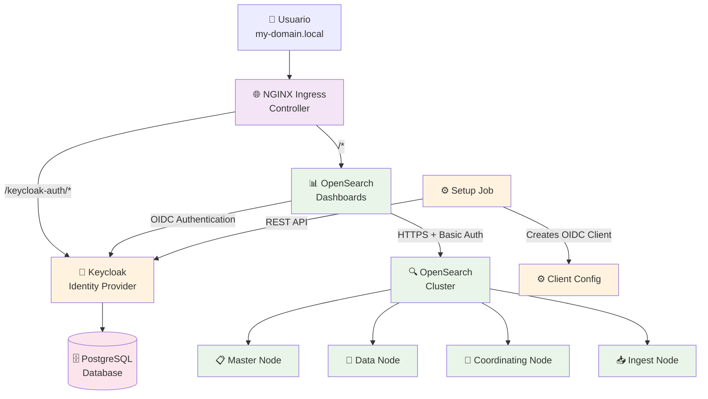
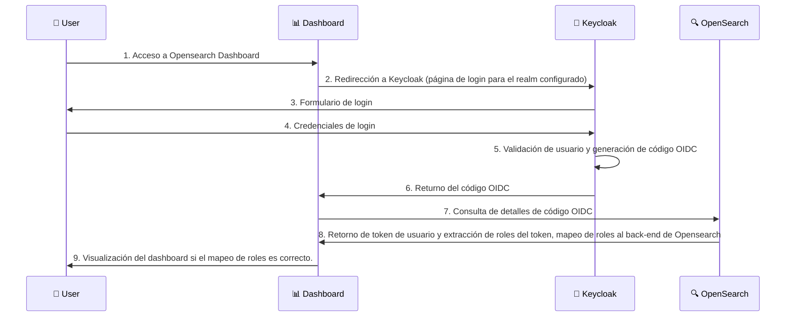

# 🔐 Keycloak + OpenSearch

Helm chart para despliegue de **Keycloak** con **OpenSearch** y **OpenSearch Dashboards**.

## 🏗️ Despliegue de componentes



### 🔄 Flujo de autenticación



## 🚀 Quick Start

### Prerequisites

- Cluster de Kubernetes (k3d, Docker Desktop, minikube, or cualquier otra distribución de Kubernetes, en función de la ditribución y la configuración existente puede requerise una configuración específica para el Chart.)
- Helm 3.x
- kubectl configurado, apuntando al contexto/cluster.

### 1. Dependencies Helm

```bash
# Repositorio Bitnami, dada la utilización de Charts Bitnami como base de la configuración.
helm repo add bitnami https://charts.bitnami.com/bitnami
helm repo update

# Actualización de dependencias
helm dependency update
```

### 2. Configuración de acceso a los ingresos del cluster (solo aplicable a desarrollo)

#### 🍎 **macOS/Linux**
```bash
# Obtención de IP local del cluster
ipconfig getifaddr en0  # macOS
ip addr show           # Linux

# Para Minikube
minikube ip


# Añadir la IP al fichero /etc/hosts (el nombre de dominio ha de ser el configurado en el chart, modificar de ser necesario si se cambia la configuración). 
echo "VALOR_IP_OBTENIDA  my-domain.local" | sudo tee -a /etc/hosts
```

#### 🪟 **Windows**
```bash
# Get your local IP
ipconfig

# Para Minikube
minikube ip

# Editar como Administrator
# Fichero: C:\Windows\System32\drivers\etc\hosts
# Añadir la IP al fichero (el nombre de dominio ha de ser el configurado en el chart, modificar de ser necesario si se cambia la configuración).
# Añadir la entrada: VALOR_IP_OBTENIDA  my-domain.local
```

### 3. Despliegue de componentes por medio del chart

```bash
# Despliegue de Keycloak + OpenSearch (maestro, datos, coordinador) + Opensearch-dashboards
# El conjunto de componentes a desplegar se puede controlar con flags de activación desactivación en el values.yaml proporcionado.
helm upgrade --install --create-namespace \
  -n keycloak-openseach \
  keycloak-openseach . \
  -f values.yaml
```

### 4. Verificación del despliegue

```bash
# Control de despliegue de pods
kubectl get pods -n keycloak-openseach
```

# 5. Configuración de Realm Keycloak.
Acceder al despliegue de Keycloak (http://my-domain.local/keycloak-auth/admin) (admin/admin123), opción crear Realm, 
importar realm, seleccionar el fichero de configuración de realm: new-realm.json.

Esto creará el realm de nombre "new" y el clientId/clientSecret (opensearch) con al correspondiente configuración de mapeo de roles válida para Opensearch.
El cliente está configurado con las correspondientes URLs de ubicación por defecto del Chart para el despliegue de opensearch-dashboards.

### 5. Accesso

Una vez desplegados los componentes estos están accesibles mediante:

- 🌐 **OpenSearch Dashboards**: http://my-domain.local
- 🔐 **Consola de adminstración de Keycloak**: http://my-domain.local/keycloak-auth/admin
- 📊 **Cuenta de usuario en Keycloak**: http://my-domain.local/keycloak-auth/realms/new/account

## Ejecución en Minikube
Minikube cuenta con su propio controlador de ingreso Nginx, proporcionado por un addon de Minikube, con lo cual deshabilitar dicho componente es necesario si se realiza el despliegue en esta plataforma.

Los pasos de ejecución serían los siguientes en el caso de Minikube:

```bash
minikube start
minikube addons enable ingress
helm repo add bitnami https://charts.bitnami.com/bitnami
helm repo update
helm dependency update
helm upgrade --install --create-namespace -n keycloak-openseach keycloak-openseach . -f values.yaml
```
Este resumen solo pretende ilustrar la preparación del cluster minikube para ejecutar los pasos de ejecución del Chart ya desglosados en puntos previos de esta documentación.
Resaltar que los valores por defecto del chart deshabilitan la creación del contrador de ingreso Nginx, teniendo en cuenta la naturaleza de pruebas del Chart en dicha plataforma.
ver values.yaml#l21

## 🔧 Configuration

### Default Credentials

| Service                 | Username   | Password       |
|-------------------------|------------|----------------|
| Keycloak Admin          | `admin`    | `admin123`     |
| Usuario app (realm new) | `testuser` | `testpassword` |

### Personalización del despliegue

Por medio de la edición del fichero `values.yaml` se pueden proporcionar los valores deseados para el despliegue de componentes:

```yaml
extras:
  host: "my-domain.local"                    # Dominio de despliegue
  hostProtocol: "http"                       # http o https
  keycloakClientSecret: "your-secret-here"   # secreto de cliente OIDC

keycloak:
  enabled: true                             # Habilitar o no despliegue de componente.
  auth:
    adminPassword: "your-admin-password"     # Contraseña de adminstración de Keycloak

opensearch:
  security:
    adminPassword: "your-opensearch-password" # Contraseña de administración del cluster opensearch
```

## 🛠️ Visualización de configuración generada

### Renderizado de plantillas de recursos Kubernetes

```bash
# Previsualización de manifiestos
helm template keycloak-openseach . -f values.yaml --output-dir ./output
```

## 🏭 Consideraciones para despliegue en producción


1. **Uso de HTTPS**: Configurar protocolo HTTPS para ingresos así como sus certificados TLS
3. **Almacenamiento persistente**: Habilitar los volúmenes de almacenamiento persistente para datos.
4. **Límite de recursos**: Se ha de revisar y establecer límites de recursos coherentes dado el dimencionamiento del despliegue.
5. **Estrategia de backup**: Se ha de implementar una política de backups para datos.
6. **Monitorización**: Integrar componentes con herramientas de monitorización en función de las necesidades deseadas
7. **Escalado**: Ajustar el número de réplicas de los componentes, así como reglas para el HPA de cara a contar con escalado dinámico de así requerirse.

## Consideraciones de configuración Opensearch + OIDC.

La configuración más relevantes de este despliegue reside en el configMap generado por la plantilla "opensearch-security-config.yaml".
Esta configuración es suministrada tanto para el despliegue de opensearch-dashboards, como para los nodos del back-end opesearch.

Es importante tener en cuenta que todo el alcance de la configuración OIDC se alberga en los siguientes alcances:
- configuración OIDC como cliente: en opensearch-dashboards, se refleja clientID/clientSecret y URL del proveedor OIDC (keycloak en nuestro caso). Se montará dicha configuración en el fichero opensearch_dashboards.yml en el contenedor de dicho componente. En dicha configuración principalmente se modela la configuración del plugin de seguridad, desde el tipo de login admitido (oidc en nuestro caso), hasta las previamente mencionadas opciones de configuración OIDC.
- configuración a nivel de opensearch backend: los nodos del cluster de opensearch necesitan una configuración del plugin de seguridad complementaria, estableciendo los métodos de login admitidos (no los seleccionados, sino los admitidos por el cluster), así como las políticas de existencia de roles, la configuración de los mismos determinando el acceso a las funcionalidades de opensearch que se les otorga y finalmente la configuración del mapeo de los roles externos (provinientes del token OIDC), su correspondiente localización en el token de seguridad y el rol interno de opensearch al que se ven ligados.
Esta información se ve reflejada en las entradas de roles.yml y roles_mapping.yml que se incluyen como ejemplos de un mapeo de roles más avanzado (en caso de necesitarse). El ejemplo proporcionado, no usa dicha configuración (ya que como se puede ver en el values.yaml no la monta como volúmenes); y se basa en el funcionamiento por defecto en que el rol "admin" que posee el usuario testuser/testpassword en el realm "new" de keycloak, mapea de forma predeterminada al rol interno "admin" de keycloak que proporciona el acceso "all_access" a todas las funcionalidades del sistema. 

De requerir roles adicionales, estos ficheros han de configurarse de la forma deseada, y montarse de manera adicional en el values.yaml de igual forma que se hace para sus homólogos sí configurados.

## Fuentes

- [Bitnami Helm Charts](https://github.com/bitnami/charts) charts base
- [OpenSearch Project](https://opensearch.org/) proyecto base de opensearch
- [Keycloak](https://www.keycloak.org/) proyecto base de keycloak
