# 🔐 Keycloak + OpenSearch

Helm chart para despliegue de **Keycloak** con **OpenSearch** y **OpenSearch Dashboards**.

## 🏗️ Despliegue de componentes

```mermaid
graph TB
    Usuario[👤 Usuario<br/>my-domain.local] --> Ingress[🌐 NGINX Ingress<br/>Controller]
    
    Ingress --> |/keycloak-auth/*| Keycloak[🔐 Keycloak<br/>Identity Provider]
    Ingress --> |/*| Dashboard[📊 OpenSearch<br/>Dashboards]
    
    Keycloak --> PostgreSQL[(🗄️ PostgreSQL<br/>Database)]
    
    Dashboard --> |HTTPS + Basic Auth| OpenSearch[🔍 OpenSearch<br/>Cluster]
    Dashboard --> |OIDC Authentication| Keycloak
    
    OpenSearch --> Master[📋 Master Node]
    OpenSearch --> Data[💾 Data Node]
    OpenSearch --> Coordinating[🔄 Coordinating Node]
    OpenSearch --> Ingest[📥 Ingest Node]
    
    Job[⚙️ Setup Job] --> |REST API| Keycloak
    Job --> |Creates OIDC Client| Config[⚙️ Client Config]
    
    classDef user fill:#e1f5fe
    classDef keycloak fill:#fff3e0
    classDef opensearch fill:#e8f5e8
    classDef infrastructure fill:#f3e5f5
    classDef database fill:#fce4ec
    
    class User user
    class Keycloak,Job,Config keycloak
    class Dashboard,OpenSearch,Master,Data,Coordinating,Ingest opensearch
    class Ingress infrastructure
    class PostgreSQL database
```



### 🔄 Flujo de autenticación

```mermaid
sequenceDiagram
    participant U as 👤 User
    participant D as 📊 Dashboard
    participant K as 🔐 Keycloak
    participant OS as 🔍 OpenSearch
    
    U->>D: 1. Acceso a Opensearch Dashboard
    D->>K: 2. Redirección a Keycloak (página de login para el realm configurado)
    K->>U: 3. Formulario de login
    U->>K: 4. Credenciales de login
    K->>K: 5. Validación de usuario y generación de código OIDC
    K->>D: 6. Returno del código OIDC 
    D->>OS: 7. Consulta de detalles de código OIDC
    OS->>D: 8. Retorno de token de usuario y extracción de roles del token, mapeo de roles al back-end de Opensearch 
    D->>U: 9. Visualización del dashboard si el mapeo de roles es correcto.
```



## 🚀 Quick Start

### Prerequisites

- Cluster de Kubernetes (k3d, Docker Desktop, minikube, or cualquier otra distribución de Kubernetes, en función de la ditribución y la configuración existente puede requerise una configuración específica para el Chart.)
- Helm 3.x
- kubectl configurado, apuntando al contexto/cluster.

### 1. Dependencies Helm

```bash
# Repositorio Bitnami, dada la utilización de Charts Bitnami como base de la configuración.
helm repo add bitnami https://charts.bitnami.com/bitnami
helm repo update

# Actualización de dependencias
helm dependency update
```

### 2. Configuración de acceso a los ingresos del cluster (solo aplicable a desarrollo)

#### 🍎 **macOS/Linux**
```bash
# Obtención de IP local del cluster
ipconfig getifaddr en0  # macOS
ip addr show           # Linux

# Para Minikube
minikube ip


# Añadir la IP al fichero /etc/hosts (el nombre de dominio ha de ser el configurado en el chart, modificar de ser necesario si se cambia la configuración). 
echo "VALOR_IP_OBTENIDA  my-domain.local" | sudo tee -a /etc/hosts
```

#### 🪟 **Windows**
```bash
# Get your local IP
ipconfig

# Para Minikube
minikube ip

# Editar como Administrator
# Fichero: C:\Windows\System32\drivers\etc\hosts
# Añadir la IP al fichero (el nombre de dominio ha de ser el configurado en el chart, modificar de ser necesario si se cambia la configuración).
# Añadir la entrada: VALOR_IP_OBTENIDA  my-domain.local
```

### 3. Despliegue de componentes por medio del chart

```bash
# Despliegue de Keycloak + OpenSearch (maestro, datos, coordinador) + Opensearch-dashboards
# El conjunto de componentes a desplegar se puede controlar con flags de activación desactivación en el values.yaml proporcionado.
helm upgrade --install --create-namespace \
  -n keycloak-openseach \
  keycloak-openseach . \
  -f values.yaml
```

### 4. Verificación del despliegue

```bash
# Control de despliegue de pods
kubectl get pods -n keycloak-openseach
```

# 5. Configuración de Realm Keycloak.
Acceder al despliegue de Keycloak (http://my-domain.local/keycloak-auth/admin) (admin/admin123), opción crear Realm, 
importar realm, seleccionar el fichero de configuración de realm: new-realm.json.

Esto creará el realm de nombre "new" y el clientId/clientSecret (opensearch) con al correspondiente configuración de mapeo de roles válida para Opensearch.
El cliente está configurado con las correspondientes URLs de ubicación por defecto del Chart para el despliegue de opensearch-dashboards.

### 5. Accesso

Una vez desplegados los componentes estos están accesibles mediante:

- 🌐 **OpenSearch Dashboards**: http://my-domain.local
- 🔐 **Consola de adminstración de Keycloak**: http://my-domain.local/keycloak-auth/admin
- 📊 **Cuenta de usuario en Keycloak**: http://my-domain.local/keycloak-auth/realms/new/account

## Ejecución en Minikube
Minikube cuenta con su propio controlador de ingreso Nginx, proporcionado por un addon de Minikube, con lo cual deshabilitar dicho componente es necesario si se realiza el despliegue en esta plataforma.

Los pasos de ejecución serían los siguientes en el caso de Minikube:

```bash
minikube start
minikube addons enable ingress
helm repo add bitnami https://charts.bitnami.com/bitnami
helm repo update
helm dependency update
helm upgrade --install --create-namespace -n keycloak-openseach keycloak-openseach . -f values.yaml
```
Este resumen solo pretende ilustrar la preparación del cluster minikube para ejecutar los pasos de ejecución del Chart ya desglosados en puntos previos de esta documentación.
Resaltar que los valores por defecto del chart deshabilitan la creación del contrador de ingreso Nginx, teniendo en cuenta la naturaleza de pruebas del Chart en dicha plataforma.
ver values.yaml#l21

## 🔧 Configuration

### Default Credentials

| Service                 | Username   | Password       |
|-------------------------|------------|----------------|
| Keycloak Admin          | `admin`    | `admin123`     |
| Usuario app (realm new) | `testuser` | `testpassword` |

### Personalización del despliegue

Por medio de la edición del fichero `values.yaml` se pueden proporcionar los valores deseados para el despliegue de componentes:

```yaml
extras:
  host: "my-domain.local"                    # Dominio de despliegue
  hostProtocol: "http"                       # http o https
  keycloakClientSecret: "your-secret-here"   # secreto de cliente OIDC

keycloak:
  enabled: true                             # Habilitar o no despliegue de componente.
  auth:
    adminPassword: "your-admin-password"     # Contraseña de adminstración de Keycloak

opensearch:
  security:
    adminPassword: "your-opensearch-password" # Contraseña de administración del cluster opensearch
```

## 🛠️ Visualización de configuración generada

### Renderizado de plantillas de recursos Kubernetes

```bash
# Previsualización de manifiestos
helm template keycloak-openseach . -f values.yaml --output-dir ./output
```

## 🏭 Consideraciones para despliegue en producción


1. **Uso de HTTPS**: Configurar protocolo HTTPS para ingresos así como sus certificados TLS
3. **Almacenamiento persistente**: Habilitar los volúmenes de almacenamiento persistente para datos.
4. **Límite de recursos**: Se ha de revisar y establecer límites de recursos coherentes dado el dimencionamiento del despliegue.
5. **Estrategia de backup**: Se ha de implementar una política de backups para datos.
6. **Monitorización**: Integrar componentes con herramientas de monitorización en función de las necesidades deseadas
7. **Escalado**: Ajustar el número de réplicas de los componentes, así como reglas para el HPA de cara a contar con escalado dinámico de así requerirse.

## Fuentes

- [Bitnami Helm Charts](https://github.com/bitnami/charts) charts base
- [OpenSearch Project](https://opensearch.org/) proyecto base de opensearch
- [Keycloak](https://www.keycloak.org/) proyecto base de keycloak
